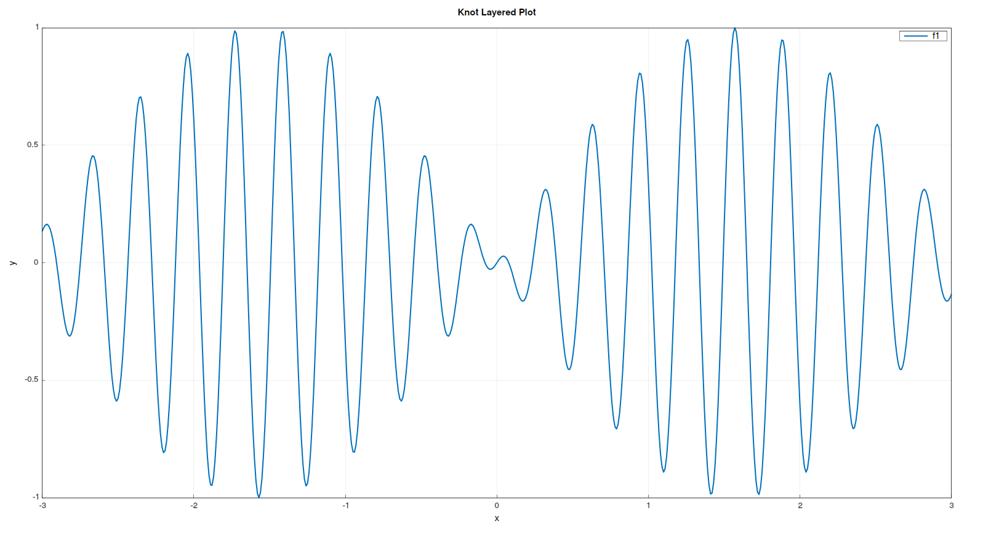
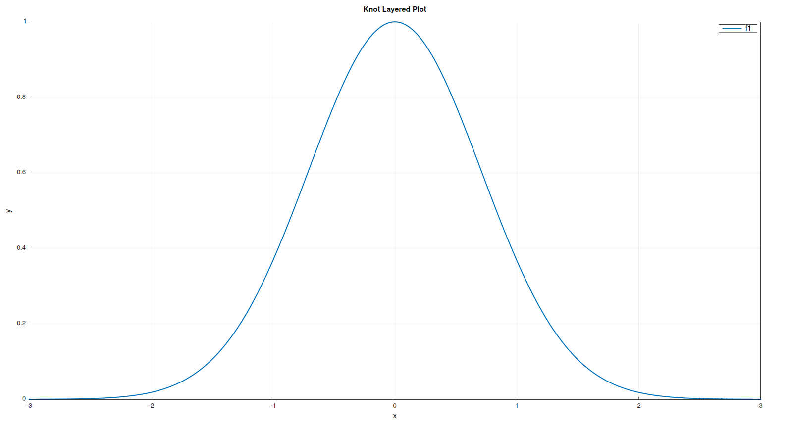
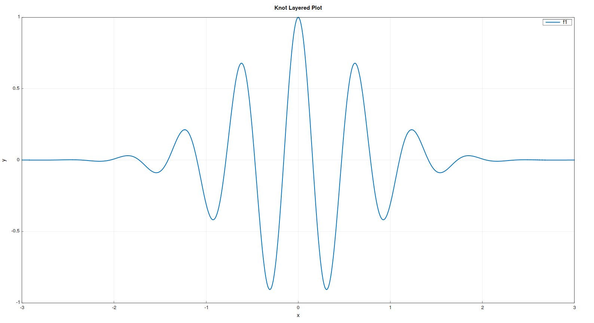
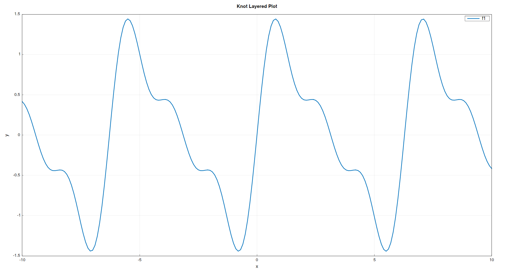

<div align="center">
  <h1>Knot</h1>
  <p>A tiny custom language to plot mathematical equations on a graph.</p>
</div>

---

## ✨ What is Knot?

**Knot** is a minimal, custom-built language that lets you write mathematical expressions and instantly see their graph.  
It’s designed to be simple, lightweight, and fun to use — just type, run, and plot!

---

## 📦 Installation

### 🔧 Prerequisites

Make sure the following are installed on your system:

- `make`
- `gnuplot`
- `gcc` and `g++`

You can install them using:

**🟢 Ubuntu / Debian (including WSL):**

```bash
sudo apt update
sudo apt install build-essential gnuplot
```

**🟣 Arch-based:**

```bash
sudo pacman -S base-devel gnuplot
```

**🪟 Windows (via Chocolatey):**

If you're on Windows, you can install all dependencies with [Chocolatey](https://chocolatey.org/).  
Open **PowerShell as Administrator** and run:

```bash
choco install mingw make gnuplot -y
```

---

### 🛠️ Installing

First, clone the repo:

```bash
git clone https://github.com/parv141206/knot
```

Then navigate to the project’s root directory and run the build script:

```bash
./build.sh
```

This will compile the project and generate the `knotc` executable inside the `build` directory.

---

### 🛣️ Run from Anywhere

To make `knotc` accessible globally from the terminal:

**🔹 On Linux / WSL:**  
Add the `build` folder to your `PATH`:

```bash
echo 'export PATH="$PATH:/path/to/knot/build"' >> ~/.bashrc
source ~/.bashrc
```

**🔹 On Windows:**  
Add the full path to the `build` folder (e.g., `C:\Users\YourName\knot\build`) to your system `PATH` via _Environment Variables_.

---

## 🚀 Basic Usage

Knot follows a very minimal custom syntax.

Write the equation(s) you want to plot in a `.knot` file.

Here’s an example inside `main.knot`:

```knot
plot y = sin(x)
```

Now plot it using:

```bash
knotc main.knot
```

Boom — this should open a Gnuplot graph window with your plot!

---

## 🧾 Basic Syntax

Knot’s syntax is intentionally clean and beginner-friendly — like Markdown, but for math graphs.

Here’s how it works:

- Every plot starts with the `plot` keyword, followed by `y =` and your equation.

  Example:

  ```knot
  plot y = x
  ```

- After the `=` sign, you can write any math expression involving `x`.  
  (No `y = mx + b` confusion — just write it and go!)

- Currently, `x` is the only variable supported — but don’t worry, a more dynamic version is on the way!

- Supported functions include `sin`, `cos`, `tan`, `log`, `exp`, and [many more!](#supported-functions)

- No semicolons. No boilerplate. Just math.

- You can stack multiple `plot` lines to layer graphs on top of each other — they’ll all show up on the same canvas.

  Example:

  ```knot
  plot y = sin(x)
  plot y = cos(x)
  ```

  This will render both the sine and cosine curves in one go!

🧠 TL;DR:  
`plot y = <math stuff with x>` — do this as many times as you want. Gnuplot handles the rest!

## Options

Currently there are 2 options which you can pass,

`--step` Set the increment in x. Default: 0.1

`--end-bound` Set the max absolute value of x. Default: 10.0

For example

```
knotc ./main.knot --step 0.01 --end-bound 3
```

## 🧮 Supported Functions

The following functions are currently supported in Knot:

| Function    | Arity | Description                                            |
| ----------- | :---: | ------------------------------------------------------ |
| `sin(x)`    |   1   | Sine of `x` (in radians)                               |
| `cos(x)`    |   1   | Cosine of `x`                                          |
| `tan(x)`    |   1   | Tangent of `x`                                         |
| `cosec(x)`  |   1   | Cosecant of `x`                                        |
| `sec(x)`    |   1   | Secant of `x`                                          |
| `cot(x)`    |   1   | Cotangent of `x`                                       |
| `sqrt(x)`   |   1   | Square root of `x`                                     |
| `log(b, x)` |   2   | Logarithm of `x` with base `b` (e.g., `log(2, 8)` → 3) |
| `ln(x)`     |   1   | Natural logarithm (base `e`) of `x`                    |
| `pow(b, e)` |   2   | `b` raised to the power `e` (e.g., `pow(2, 3)` → 8)    |
| `abs(x)`    |   1   | Absolute value of `x`                                  |
| `exp(x)`    |   1   | `e` raised to the power `x`                            |
| `floor(x)`  |   1   | Largest integer ≤ `x`                                  |
| `ceil(x)`   |   1   | Smallest integer ≥ `x`                                 |

> 📝 **Arity** just means the number of arguments the function takes.  
> So `sin(x)` has arity 1, while `log(b, x)` has arity 2.

More functions will be added soon — feel free to [open an issue](https://github.com/parv141206/knot/issues) if you have requests!

## Few beautiful expressions!

1. Arctic Monkeys album cover

```knot
plot y = sin(x) * cos(20*x)
```

Options: `--step 0.01 --end-bound 3`



2. Gaussian Curve

```knot
plot y = exp(-x * x)
```

Options: `--step 0.01 --end-bound 3`



3. Damped Oscillation

```knot
plot y = exp(-x * x) * cos(10 * x)
```

Options: `--step 0.01 --end-bound 3`



4. Rollercoaster

```knot
plot y = sin(x) + sin(2 * x) / 2 + sin(3 * x) / 3
```


